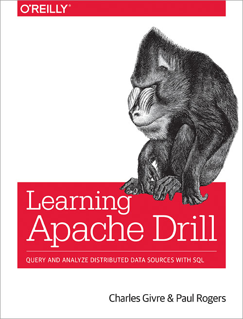

# Learning Apache Drill
Get up to speed with Apache Drill, an extensible distributed SQL query engine that reads massive datasets in many popular file formats such as Parquet, JSON, and CSV. Drill reads data in HDFS or in cloud-native storage such as S3 and works with Hive metastores along with distributed databases such as HBase, MongoDB, and relational databases. Drill works everywhere: on your laptop or in your largest cluster.

In this practical book, Drill committers Charles Givre and Paul Rogers show analysts and data scientists how to query and analyze raw data using this powerful tool. Data scientists today spend about 80% of their time just gathering and cleaning data. With this book, you’ll learn how Drill helps you analyze data more effectively to drive down time to insight.

* Use Drill to clean, prepare, and summarize delimited data for further analysis
* Query file types including logfiles, Parquet, JSON, and other complex formats
* Query Hadoop, relational databases, MongoDB, and Kafka with standard SQL
* Connect to Drill programmatically using a variety of languages
* Use Drill even with challenging or ambiguous file formats
* Perform sophisticated analysis by extending Drill’s functionality with user-defined functions
* Facilitate data analysis for network security, image metadata, and machine learning

## Purchasing
You can download an electronic copy of Learning Apache Drill on Safari Books http://shop.oreilly.com/product/0636920142898.do or on Amazon. 

## Authors

* Charles Givre CISSP, Lead Data Scientist, Deutsche Bank, Co-Founder GTK Cyber http://www.thedataist.com
* Paul Rogers, Big Data Engineer, Cloudera
